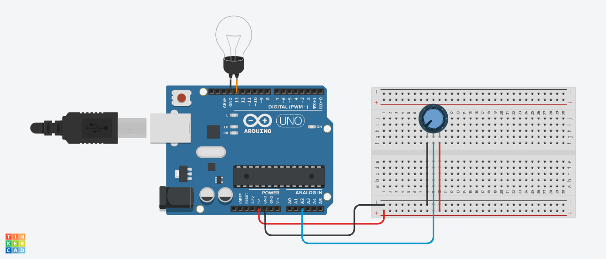
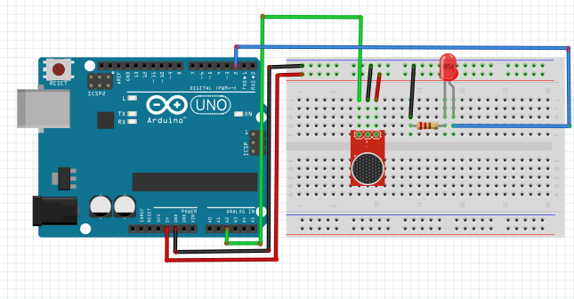

# DOCUMENTAÇÃO ABAJETO

## 1. Introdução
   O presente trabalho tem como finalidade pesquisar, discutir, elaborar, desenvolver e publicar um projeto em grupo. O qual consiste em criar um esquema elétrico para realizar determinadas tarefas, as quais foram discutidas pela equipe. Para a criação do mesmo foi utilizado ferramentas online gratuitas e vídeo aulas disponibilizadas na plataforma Moodle.


### Adaptação:


## 2. Objetivos
   O projeto final consiste em construir um esquema elétrico o qual deve acender uma lâmpada quando o usuário bater 2 palmas e apagar a lâmpada quando o usuário bater 1 palma. Para a realização foi feito a elaboração do sistema no aplicativo Fritzing, adaptando a ideia com os recursos disponíveis.
   
## 3. Materiais utilizados
### Lista de Materiais 
#### Adaptação:
 - Arduino Uno R3;
 - Placa de ensaio pequena;
 - Lâmpada;
 - Potenciômetro;
 - 7 Fios.
#### Projeto Original:
 - Arduino Uno R3;
 - Placa de ensaio pequena;
 - Led/Lâmpada;
 - Resistor;
 - Módulo de microfone;
  - 7 Fios. 

### Lista de Ferramentas
 - Tinkercad;
 - Fritzing;
 - StackEdit;
 - GitLab.

## 4. Esquema Elétrico



## 5. Código


### Adaptação:
```markdown
//Criando duas constantes para poupar memória

define POT A2; // Constante para indicar a entrada analógica do potenciômetro
define LAMP 13; // Constante para indicar a entrada digital da lâmpada

int valor = 0;

void setup()
{
   Serial.begin(9600);
   pinMode(POT, INPUT);
   pinMode(LAMP, OUTPUT);
}

void loop()
{
  valor = analogRead(POT); // Variavel recebe o valor do potenciômetro   
   
  if(valor < 250)
  {
     digitalWrite(LAMP, LOW); // Desliga a lâmpada caso o potenciômetro esteja abaixo de 250
     delay(800); // Delay de 0.8 segundos
  }

  else
  {
     digitalWrite(LAMP, HIGH); // Caso contrário liga a lâmpada 
     delay(800); // Delay de 0.8 segundos
  }
   Serial.println(valor);
}
```

## 6. Resultados
O vídeo de demonstração do projeto original pode ser visto em:

Vídeo retirado do canal Bit a Bit.

O vídeo de demonstração do projeto adaptado pode ser visto em:


## 7. Desafios encontrados

 - Indecisão na escolha do projeto;
 - Dificuldades para montar o esquema elétrico;
 - Falta de recursos no programa;
 - Tempo limitado para montar o projeto fisicamente;
 - Desencontro de horários para elaboração;
